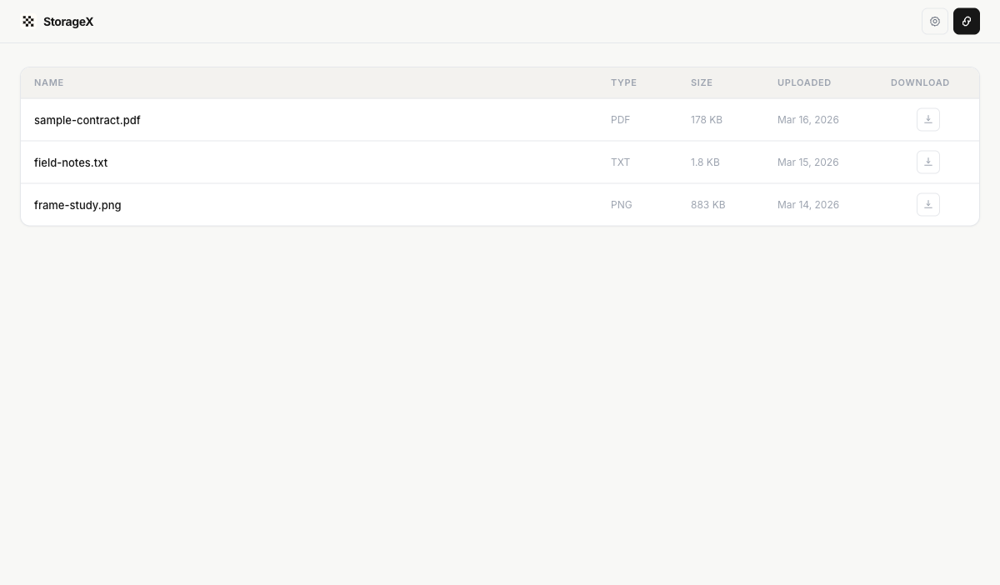

# StorageX

StorageX is an experimental local-first tool that turns supported files into encrypted bit-video uploads, stores them in your own YouTube account, and later recovers the original bytes.

It is built for technical users who want to run the whole flow locally on their own machine with their own Google OAuth client.



## Why this exists

- Encrypt a supported file with a 24-digit key.
- Encode the encrypted payload into a reversible bit-grid video format.
- Upload a YouTube-compatible archive video to your own channel.
- Recover the original file later by downloading the YouTube video and decoding it locally.

## Status

StorageX is an experimental tool, not a guaranteed backup service.

Use it when you are comfortable with:

- bringing your own Google OAuth credentials
- running a local FastAPI app
- keeping local auth state on your own machine
- YouTube being a third-party dependency that can fail or change

## Current features

- Encrypt supported files with a `24`-digit key before they leave the machine.
- Upload encrypted archive videos into your own YouTube account.
- Recover the original file later through the local download and decode flow.
- Create single-use public share links for individual files without exposing the 24-digit key to recipients.
- Create and save a temporary public URL from `Settings` with the built-in quick-tunnel button when `cloudflared` is installed.
- Review active links, revoke them manually, and inspect download IPs from the owner-side links screen.
- Keep YouTube client credentials and OAuth login persisted across app restarts.
- Organize the library with local-only folders stored in `data/library-index.json`.
- Rename files inline inside the library without changing the archived payload on YouTube.
- Delete files from StorageX and from YouTube so they stay gone after reload.
- Delete folders locally while moving their files back into `All files`.
- Keep the encryption key session-only in the browser instead of persisting it to disk.
- Reuse the last known library on reload while the app refreshes live state in the background.

## Requirements

- macOS or another machine that can run Python 3.13 and `ffmpeg`
- a local browser for Google OAuth
- your own Google Cloud OAuth client with YouTube Data API v3 enabled
- the same YouTube account signed into Chrome or Safari on this Mac if recovery needs browser cookies
- if you use public sharing, a reverse proxy or tunnel that exposes only the public share routes
- `cloudflared` if you want the `Create public URL` button to generate a temporary public URL for you

## Quickstart

1. Install dependencies and start the app:

```bash
cd /path/to/storagex
./run.sh
```

2. Open `http://127.0.0.1:8000`.
3. Open `Settings`.
4. Paste your Google OAuth `Client ID` and `Client Secret`.
5. Click `Connect` and finish the Google / YouTube sign-in flow.
6. Upload a supported file.
7. Organize files with local folders.
8. In `Settings`, either paste a `Public App URL` or click `Create public URL`.
9. Use `Download` later to recover the original file, or `Share` to copy a one-time public link for a partner.

## Google OAuth setup

Create your own OAuth client in Google Cloud:

- enable `YouTube Data API v3`
- create an OAuth client of type `Web application`
- add this origin:
  - `http://127.0.0.1:8000`
- add this redirect URI:
  - `http://127.0.0.1:8000/auth/youtube/callback`
- if the app is in Google testing mode, add your Google account as a test user

StorageX expects you to bring your own client credentials. It does not ship with shared Google credentials.

## Supported files and limits

- Upload inputs: all file types are supported
- Common examples:
  - `.pptx`
  - `.xlsx`
  - `.docx`
  - `.pdf`
  - images
  - videos
  - archives
  - plain text
- Upload size before encoding: no fixed hard cap; practical limits are local disk, encode time, and YouTube processing behavior
- Local decode upload size limit: `1 GB`
- Encryption key format: exactly `24` digits

## Organization model

- StorageX uses virtual folders stored only on this machine.
- Folder names, file placement, and local file renames live in `data/library-index.json`.
- Those organization changes do not modify YouTube metadata and are not synced across devices.
- If the local index is removed or rebuilt, files fall back to their original uploaded filename in `All files`.
- File renaming happens only inside the local library view and does not change the archived payload.

## Local state and privacy

StorageX stores local runtime state in this folder:

- `data/youtube-auth.json`
- `data/library-index.json`
- `data/app-settings.json`
- `data/shares.json`
- `data/share-artifacts/`

Completed encode and download job files do not persist in `data/`.
StorageX writes those work files only to an OS temp directory and removes them after the artifact download finishes or when the app restarts.

That file can contain:

- your saved OAuth client ID
- your saved OAuth client secret
- your Google refresh token / access token state
- pending OAuth PKCE state during sign-in

The library index can contain:

- your local folder tree
- per-file folder assignment
- per-file local display name override

The app settings file can contain:

- your saved `Public App URL`

The share store can contain:

- active, used, revoked, expired, or replaced single-file share tokens
- per-share file metadata such as display name, size, and media type
- share creation / expiry / use timestamps
- per-download audit records such as IP address, timestamp, and user agent

The share artifact directory can contain:

- temporary prepared downloads for active public share links

Behavior notes:

- the file is local-only and written with `0600` permissions when possible
- the UI encryption key is stored only in browser session storage if you save it there
- restarting the app reloads saved YouTube credentials from disk, but does not reload the encryption key
- local recovery may use browser cookies from Chrome or Safari when `yt-dlp` needs them to access your video
- public share links do not store the 24-digit key
- the owner enters the 24-digit key while creating the share, not the recipient
- the copied share link is the secret needed for shared download access
- successful shared downloads are logged with timestamp, IP, and user agent in the local share record
- public sharing is intended for a reverse proxy that exposes `/s/*` and `/api/shares/*` while keeping the main app private

Additional persisted files:

- `data/app-settings.json`
- `data/shares.json`

More detail lives in [docs/local-state.md](docs/local-state.md).

If you want to wipe local YouTube state, use `Settings` → `Reset local YouTube setup`.

## Optional environment configuration

The UI setup is the primary path. Environment variables are still supported for technical users:

- `YOUTUBE_CLIENT_ID`
- `YOUTUBE_CLIENT_SECRET`
- `YOUTUBE_PRIVACY_STATUS`
- `YOUTUBE_DOWNLOAD_BROWSER`
- `YOUTUBE_DOWNLOAD_COOKIEFILE`
- `YOUTUBE_DOWNLOAD_JS_RUNTIME`

## Public share links

- Shares are single-file only.
- Each share link stays valid for `24 hours`.
- The first download marks the link as used and blocks any second download.
- Creating a new share for the same file replaces the previous active token.
- The owner enters the `24`-digit key while creating the share so recipients never need the key.
- Recipients open the public link and download the original file without installing StorageX.
- Used links stay visible in the owner links screen for tracking, while revoked links are hidden there.
- The owner can inspect active and used links, review download IPs, and revoke links manually from the app.
- The `Create public URL` button in `Settings` starts a temporary Cloudflare Quick Tunnel and saves the returned root URL when `cloudflared` is installed locally.
- Keep the main StorageX UI behind your own auth, VPN, or reverse proxy. Only expose the public share routes externally.

## Common failure cases

- `redirect_uri_mismatch`
  - your Google OAuth redirect URI does not exactly match `http://127.0.0.1:8000/auth/youtube/callback`
- `access_denied`
  - your Google account is not listed as a test user for the OAuth app
- `Google rejected the client secret`
  - the client ID and client secret do not belong to the same OAuth client
- `Could not access that YouTube video`
  - sign into the same YouTube account in Chrome or Safari on this Mac and try recovery again
- `The saved YouTube session expired`
  - reconnect the account in the app

## Development

Run the test suite:

```bash
cd /path/to/storagex
uv run pytest -q
```

Manual release smoke steps live in [docs/release-smoke-test.md](docs/release-smoke-test.md).

## License

[MIT](LICENSE)
